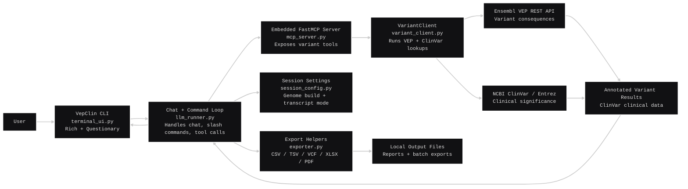

<div align="center">
  
<br/><sub><code>Exon the Axolotl</code></sub>
<br/>
  
# VepClin-MCP

VepClin-MCP is a terminal-based bioinformatics CLI chat tool that integrates Ensembl VEP, NCBI ClinVar, a custom-built MCP server layer, and OpenRouter's NVIDIA Nemotron 3 Ultra model to look up variant consequences and clinical significance, presenting the results as clear, readable summaries in a Rich-powered CLI.

</div>

</br>

</br>
</br>


## Features
- NVIDIA Nemotron 3 Ultra powered chat interface
- Ensembl VEP integration for genomic and transcript-qualified HGVS variant consequence lookup
- ClinVar integration for clinical significance, oncogenicity, review status, traits, & variation IDs
- Export batch results as CSV, TSV, annotated VCF, or multi-sheet Excel (.xlsx)
- Single-variant PDF report generation
- Gruvbox-styled Rich terminal interface with readable panels, tables, & status messages, featuring pixel-art mascot `Exon the Axolotl`
- MCP server layer exposing custom reusable variant annotation tools

## Commands
| Command | Description |
|---|---|
| `/batch` | Upload VCF files & summarize multiple variants (up to 200 at a time) |
| `/export` | Save latest batch results as CSV, TSV, VCF, or Excel `.xlsx` |
| `/report` | Save single-variant lookups as a PDF report |
| `/build` | Switch between GRCh38 and GRCh37 lookups |
| `/transcripts` | Choose MANE Select-only results or all transcript consequences |
| `/clear` | Reset the conversation context |
| `/help` | Show usage tips and this command list |
| `/exit` or `/quit` | Quit VepClin |

## Technologies Used
- CLI/UI: `Python`, `Rich`, `Questionary`
- MCP Layer: `FastMCP`
- HTTP/API Client: `httpx`
- AI: OpenRouter API, NVIDIA Nemotron 3 Ultra
- Variant Annotation: Ensembl VEP REST API
- Clinical Data: `NCBI ClinVar` via `Biopython Entrez`
- Excel/PDF Export: `openpyxl`, `ReportLab`
- Storage: Local `config.json` file for genome build & transcript-mode preferences
- Packaging: `setuptools`, `pyproject.toml`
- Testing: `pytest`, `FastMCP` test client

## Architecture Diagram


## Quick Install

#### Windows PowerShell

```powershell
python -m venv .venv
.venv\Scripts\Activate.ps1
python -m pip install git+https://github.com/shivankvirdi/VepClin-MCP.git
```

#### macOS / Linux

```bash
python3 -m venv .venv
source .venv/bin/activate
python -m pip install git+https://github.com/shivankvirdi/VepClin-MCP.git
```

### Set API keys & email as environment variables
`OPENROUTER_API_KEY` is required for the LLM chat interface (https://openrouter.ai/).    
`NCBI_EMAIL` is recommended for consistent NCBI Entrez/ClinVar requests.  
`NCBI_API_KEY` is optional, but recommended for higher ClinVar request limits (https://www.ncbi.nlm.nih.gov/datasets/docs/v2/api/api-keys/).  
#### Windows PowerShell:

```powershell
[Environment]::SetEnvironmentVariable("OPENROUTER_API_KEY", "sk-or...", "User")
[Environment]::SetEnvironmentVariable("NCBI_EMAIL", "you@example.com", "User")
[Environment]::SetEnvironmentVariable("NCBI_API_KEY", "...", "User")
```

#### macOS / Linux:

```zsh
# Zsh
echo 'export OPENROUTER_API_KEY="sk-or..."' >> ~/.zshrc
echo 'export NCBI_EMAIL="you@example.com"' >> ~/.zshrc
echo 'export NCBI_API_KEY="..."' >> ~/.zshrc
source ~/.zshrc
```
```bash
# Bash
echo 'export OPENROUTER_API_KEY="sk-or..."' >> ~/.bashrc
echo 'export NCBI_EMAIL="you@example.com"' >> ~/.bashrc
echo 'export NCBI_API_KEY="..."' >> ~/.bashrc
source ~/.bashrc
```
## Install from Source

#### Windows PowerShell

```powershell
git clone https://github.com/shivankvirdi/VepClin-MCP.git
cd VepClin-MCP
python -m venv .venv
.venv\Scripts\Activate.ps1
python -m pip install -e .
Copy-Item .env.example .env
```

#### macOS / Linux

```bash
git clone https://github.com/shivankvirdi/VepClin-MCP.git
cd VepClin-MCP
python3 -m venv .venv
source .venv/bin/activate
python -m pip install -e .
cp .env.example .env
```

Follow `.env.example` and add your API keys & email to `VepClin-MCP/.env` in the repo root.

## Running VepClin-MCP

Run the terminal chat CLI:

```bash
vepclin
```
## Running only MCP server
Most users don't need this. The `vepclin` chat CLI starts and uses the MCP tools automatically.
```bash
vepclin-server
```

If you installed from source, you can also run the server directly:

```bash
python backend/mcp_server.py
```
